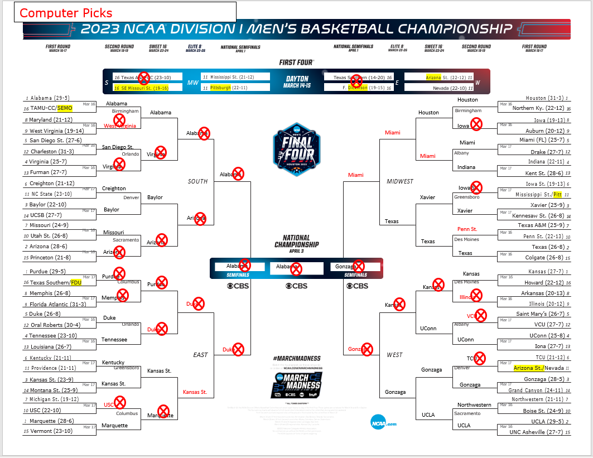

# MarchMadness
Predicts a March Madness bracket based off the team's seed and a weighted coin flip.

My weighted coin flip works like this: It assigns one team to "heads" and other to "tails." Which ever team reaches their seed number first wins that bracket.

Example: 

Duke (seed 3) vs. Texas Tech (seed 5)

Duke = "Heads" (H)

Texas Tech = "Tails" (T)

Flips:
'H', 'T', 'T', 'T', 'H', 'T', 'T', 'T', 'H', 'H', 'H', 'T', 'H', 'T', 'H', 'T', 'T'

Winner is: Texas Tech

The winner is Texas Tech because in the first 7 flips there are 5 "T's" and only 2 "H's". Therefore, it is predicted that Texas Tech will upset Duke.

The program ensures the following attributes about the bracket:
- Must have at least one 5 seed vs. 12 seed upset
- Must have at least one 1 seed in the Final Four
- The sum of the seeds in the Final Four must be >= 12

